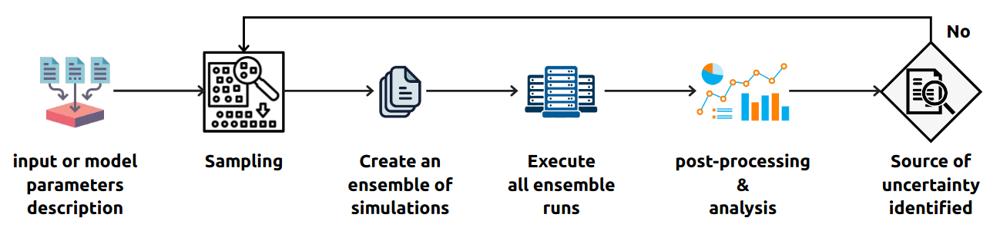

The computing pattern, also called Multiscale Computing Patterns (MCP), are aimed to simplify the implementation of the multiscale application by enhancing the execution of scenarios. From the application’s point of view, a pattern can determine the ordering and composition of single scale models that are coupled within a multiscale application.

## UQP
Uncertainty quantification (UQ) is an increasingly important field in the simulation-based modelling of scientific applications. It can be defined as a bridge between the statistical and probability theory, computer simulation-based techniques with 'the real world'. In other words, by identifying the source of uncertainty in each component of the model, UQ aims to make the results more reliable and have close predictions of the complex physical systems. A typical UQ problem involves one or more mathematical model subjects to some uncertainty of model parameter value.


<figure>
    
   Software architecture of the UQ system
</figure>


Uncertainty Quantification Pattern (UQP) is the term for workflows and algorithms focused on uncertainty quantification and propagation or sensitivity analysis. A general procedure/workflow for UQP can be defined as follows:

* Create an ensemble of simulations, i.e. individual runs of model simulation executions, containing different input or model parameters for each run;
* Execute all ensemble runs;
* Perform post-processing analysis by using statistical techniques, such as the Monte Carlo, Polynomial  Chaos  and  the  Stochastic  Collocation  methods, to measure the error distribution for each input or model parameters (individually);
* Refine and report the previous steps until the confidence in the simulation results is reached, i.e. identifying the source of uncertainty in the model parameters.

## VVP

Verification and validation (V&V) provide a framework for building confidence in computational simulation predictions. The Verification process addresses the quality of the numerical treatment of the model that is used in the predication, and the validation process addresses the quality of the model. The inclusion of V&V is the key to obtain credibility of a proposed model. Given the diversity of applications, there is no doubt that having a V&V pattern increases trustworthiness of the simulation model. 

Within [VECMA](https://www.vecma.eu/) project,  we identified *four* prominent V&V patterns which are most suitable for multiscale computing applications:

1. Stable Intermediate Forms (SIF)
2. Level of Refinement (LoR)
3. Ensemble Output Validation (EoV)
4. Quantities of Interest Distribution Comparison (QDC)

Within FabSim3, we provide support for these V&V patterns as follow:


### Level of Refinement (LoR)

`ensemble_vvp_LoR` function goes through all the output directories and calculates the scores

```python
def ensemble_vvp_LoR(results_dirs_PATH, load_QoIs_function, aggregation_function, **kwargs)
	...
```

where

* `results_dirs_PATH`: list of result dirs, one directory for each resolution and each one containing the same QoIs stored to disk.
* `load_QoIs_function`: a function which loads the QoIs from each subdirectory of the results_dirs_PATH.
* `aggregation_function`: function to combine all results
* `**kwargs`: The optional input parameter items that will be passed to `aggregation_function` function.


* The return score is in `dictionary` format and has the following structure:
	```yaml
	result_dir_1_name:
	    order: <polynomial_order>
	    runs: <num_runs>
	    value:
	        vary_param_1: {<sobol_func_name>:<value>}
	        ...
	        vary_param_X: {<sobol_func_name>:<value>}
	...
	result_dir_N_name:
	      order: <polynomial_order>
	      runs: <num_runs>
	      value:
	            vary_param_1: {<sobol_func_name>:<value>}
	            ...
	            vary_param_X: {<sobol_func_name>:<value>}	
	```

**A usage example from the FabFlee plugin**

=== "Usage Example"

    ``` python
    from fabsim.VVP.vvp import ensemble_vvp_LoR
    ensemble_vvp_LoR(
        results_dirs_PATH=sobol_work_dir,
        load_QoIs_function=load_QoIs_function,
        aggregation_function=plot_convergence,
        plot_file_path=sobol_work_dir        
    )
    ```

=== "load_QoIs_function"

    ```python
	def load_QoIs_function(result_dir):
	    """
	    we load input sobols.yml with this structure:
	    vary_param_1:
	        sobols_first: <array[....]>
	        sobols_first_gmean: <value>
	        sobols_first_mean: <value>
	    ...
	    vary_param_N:
	        sobols_first: <array[....]>
	        sobols_first_gmean: <value>
	        sobols_first_mean: <value>
	    campaign_info:
	        distribution_type: <str>
	        name: <str> # name of campaign
	        num_runs: <int>
	        polynomial_order: <int>
	        sampler: <str> # name of sampler
	        work_dir: <str> # PATH to this campaign result
	    The returns values are : QoIs_values,polynomial_order
	        In this implementation, QoIs_values has this
	    vary_param_1:
	        score: <value>
	    ...
	    vary_param_N:
	        score: <value>
	    """
	    data_file_name = os.path.join(result_dir, "sobols.yml")
	    sobols_data = yaml.load(open(data_file_name), Loader=yaml.SafeLoader)
	    polynomial_order = sobols_data["campaign_info"]["polynomial_order"]
	    num_runs = sobols_data["campaign_info"]["num_runs"]
	    del sobols_data["campaign_info"]

	    # sobols_first_mean or sobols_first_gmean
	    score_column_name = "sobols_first_mean"

	    QoIs_values = {}
	    for param in sobols_data:
	        QoIs_values.update({param: {}})
	        for key in sobols_data[param]:
	            if key == score_column_name:
	                QoIs_values[param].update({
	                    key: sobols_data[param][key]
	                })

	    return QoIs_values, polynomial_order, num_runs
    ```

=== "aggregation_function"

    ``` python
	def plot_convergence(scores, plot_file_path):
	    """
	    The VVP agregation_function, compares the sobol indices (as function of
	    the polynomial order)
	    input scores structure:
	    result_dir_1_name:
	        order: <polynomial_order>
	        value:
	            vary_param_1: {<sobol_func_name>:<value>}
	            ...
	            vary_param_z: {<sobol_func_name>:<value>}
	    ...
	    result_dir_N_name:
	        order: <polynomial_order>
	        value:
	            vary_param_1: {<sobol_func_name>:<value>}
	            ...
	            vary_param_z: {<sobol_func_name>:<value>}

	    ------------------------------------------------------------------
	    NOTE: Here, we use the result with maximum polynomial order as the
	        reference value
	    """
	    last_item_key = list(scores)[-1]

	    #############################################
	    # ref_sobols_value structure:               #
	    #                                           #
	    # vary_param_1: {<sobol_func_name>:<value>} #
	    # ...                                       #
	    # vary_param_n: {<sobol_func_name>:<value>} #
	    #############################################
	    xticks = []
	    ref_sobols_value = scores[last_item_key]["value"]

	    results = {}
	    results.update({"polynomial_order": []})
	    compare_res = {}
	    for run_dir in scores:
	        polynomial_order = scores[run_dir]["order"]
	        num_runs = scores[run_dir]["runs"]
	        xticks.append("PO={}\nruns={}".format(polynomial_order, num_runs))
	        results["polynomial_order"].append(polynomial_order)
	        poly_key = "polynomial_order {}".format(polynomial_order)
	        compare_res.update({poly_key: {}})
	        for param in scores[run_dir]["value"]:
	            if param not in results:
	                results.update({param: []})
	            sb_func_name = list(scores[run_dir]["value"][param].keys())[0]
	            sb = scores[run_dir]["value"][param][sb_func_name]
	            results[param].append(sb)

	    #############################################
	    # plotting results                          #
	    # results dict structure                    #
	    #       vary_param_1: [run1,run2,...]       #
	    #       vary_param_2: [run1,run2,...]       #
	    #       polynomial_order: [po1,po2,...]     #
	    #############################################

	    params = list(results.keys())
	    params.remove("polynomial_order")

	    fig, ax = plt.subplots()
	    ax.set_xlabel("Polynomial Order")
	    ax.set_ylabel("sobol indices")
	    ax.set_title("convergence", fontsize=10, fontweight="bold")

	    X = range(len(results["polynomial_order"]))
	    for param in params:
	        ax.plot(X, results[param], label=param)

	    plt.xticks(X, xticks)
	    plt.tight_layout()
	    plt.legend(loc="best")
	    convergence_plot_file_name = "vvp_QoI_convergence.png"
	    plt.savefig(os.path.join(plot_file_path, convergence_plot_file_name),
	                dpi=400)

	    print("=" * 50)
	    print("The convergence plot generated ...")
	    print(os.path.join(plot_file_path, convergence_plot_file_name))
	    print("=" * 50)
    ```
=== "**kwargs"
	In this example, we pass the input arguments `plot_file_path=sobol_work_dir` to the function. As it mentioned before, all `**kwargs` variables will be passed to the `aggregation_function`


### Ensemble Output Validation (EoV)

`ensemble_vvp` function goes through all the output directories and calculates the scores.
```python
def ensemble_vvp(results_dirs, sample_testing_function, aggregation_function, **kwargs)
	...
```

* `results_dirs`: list of result dirs to analyse.
* `sample_testing_function`: analysis/validation/verification function to be performed on each subdirectory of the `results_dirs`.
* `aggregation_function`: function to combine all results.
* `**kwargs`: The optional input parameter items that can be used to give explicit ordering of the various subdirectories.

The `ensemble_vvp` function returns a `dict` containing the score per each `results_dirs` sub-directory.

**A usage example from the FabFlee plugin**

=== "Usage Example"

    ``` python
    import fabsim.VVP.vvp as vvp
    vvp.ensemble_vvp(
        results_dirs="{}/{}/RUNS".format(env.local_results, results_dir),
        sample_testing_function=vvp_validate_results,
        aggregation_function=make_vvp_mean
    )
    ```

=== "sample_testing_function"

    ``` python
	def vvp_validate_results(output_dir="", **kwargs):
	    """ Extract validation results (no dependencies on FabSim env). """

	    flee_location_local = user_config["localhost"].get(
	        "flee_location", user_config["default"].get("flee_location"))

	    local("python3 %s/flee/postprocessing/extract-validation-results.py %s "
	          "> %s/validation_results.yml"
	          % (flee_location_local, output_dir, output_dir))

	    with open("{}/validation_results.yml".format(output_dir), 'r') as val_yaml:
	        validation_results = yaml.load(val_yaml, Loader=yaml.SafeLoader)

	        # TODO: make a proper validation metric using a validation schema.
	        # print(validation_results["totals"]["Error (rescaled)"])
	        print("Validation {}: {}".format(output_dir.split("/")[-1],
	                                         validation_results["totals"][
	                                         "Error (rescaled)"]))
	        return validation_results["totals"]["Error (rescaled)"]

	    print("error: vvp_validate_results failed on {}".format(output_dir))
	    return -1.0
    ```

=== "aggregation_function"

    ``` python
	def make_vvp_mean(np_array, **kwargs):
	    mean_score = np.mean(np_array)
	    print("Mean score: {}".format(mean_score))
	    return mean_score
    ```


### Quantities of Interest Distribution Comparison (QDC)

`ensemble_vvp_QoI` function goes through all the output directories and calculates several similarity measures.
```python
def ensemble_vvp_QoI(simulation_result_QoI, uncertainty_result_QoI, QoI_name)
	...
```
where

* `simulation_result_QoI` : the experimental QoI data.
* `uncertainty_result_QoI` : the uncertainty QoI results
* `QoI_name` : the name of QoI

In the current implementation, the current supported similarity measure are:
* Jensen-Shannon divergence
* Renyi divergence
* Cosine distance
* Euclidean distance
* Kullback-Leibler divergence

And `ensemble_vvp_QoI` function returns a dictionary contains the  calculated similarity measure with the following structure: 
    ``` json
	{
	    "similarity measure function name":
	    {
	        "QoI_name" : [similarity_measure_function_result]
	    }
	}
    ```

**A usage example from the FabFlee plugin**

=== "Usage Example"

    ``` python
    from fabsim.VVP.vvp import ensemble_vvp_QoI
    ensemble_vvp_QoI(
        simulation_result_QoI=sim_result,
        uncertainty_result_QoI=uncertainty_result,
        QoI_name=QoI_name
    )
    ```

=== "simulation_result_QoI"
	`sim_result` array contains the simulation results for QoI (here `Total Error`) column.

=== "uncertainty_result_QoI"
	`uncertainty_result` array contains the results for QoI (here `Total Error`) with uncertainty.

=== "QoI_name"
	`QoI_name` is the name of target QoI.

